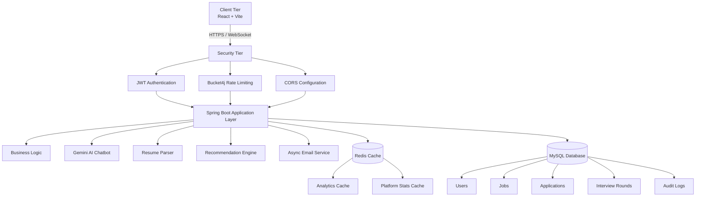
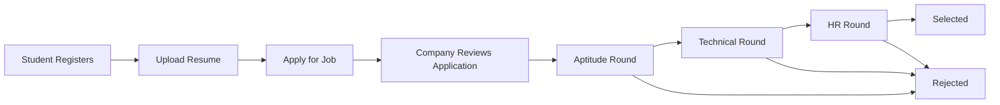
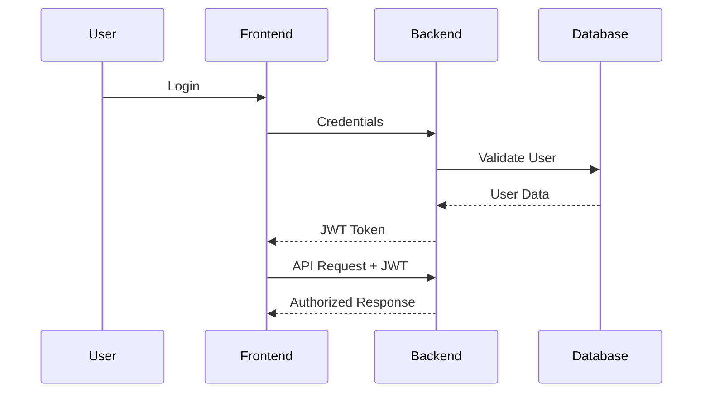
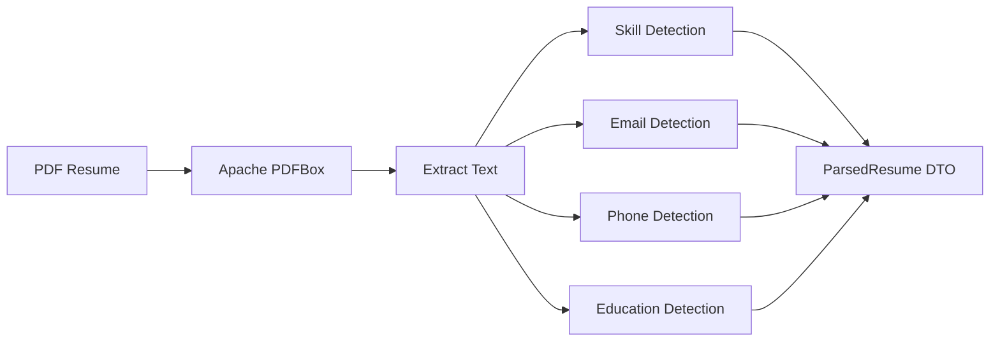
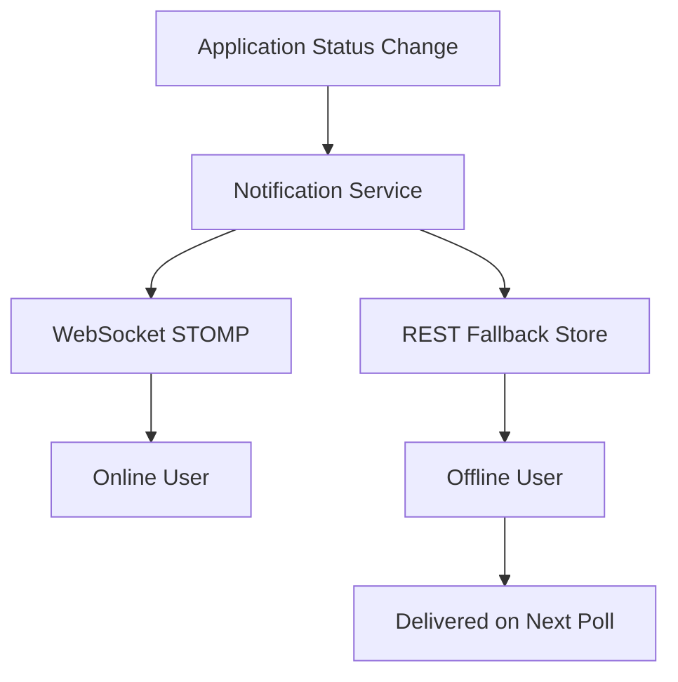
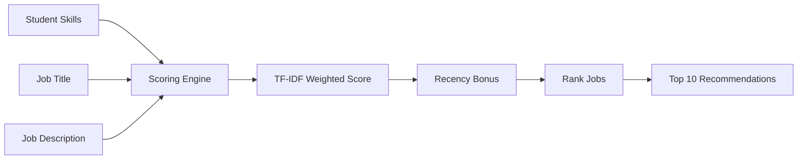

# 🎓 Campus Placement Management System
A production-grade, full-stack web application built to orchestrate the complete university placement lifecycle. It connects **Students**, **Companies**, and **Administrators** on a single platform — handling job postings, multi-round application tracking, AI-powered assistance, automated resume parsing, and real-time WebSocket notifications.
[](#)
[](#)
[](#)
[](https://opensource.org/licenses/MIT)
🔗 **Source Code:** [GitHub Repository](https://github.com/shrenik879/CampusPlacementManagement)
---
## 🏗️ System Architecture




---
## 🌟 Features by Role
### 👨‍🎓 Student Portal
- **Dashboard** — View profile, active applications, and personalized job recommendations.
- **Job Search & Apply** — Browse open jobs and submit applications with one click.
- **My Applications** — Track all applications and statuses (Pending / In-Progress / Selected / Rejected).
- **Resume Upload** — Upload PDF resume; system auto-parses skills, email, and phone using **Apache PDFBox**.
- **Real-Time Notifications** — Instant WebSocket alerts when application status changes or rounds are scheduled.
### 🏢 Company Portal
- **Company Dashboard** — Post jobs, manage listings (Open/Closed), and view all applicants.
- **Applicants Board** — Review all candidates who applied, update their statuses.
- **Interview Rounds** — Create sequential interview rounds (Aptitude → Technical → HR). System automatically marks application SELECTED when all rounds PASSED, or REJECTED on any FAILED round.
- **Analytics Dashboard** — View real-time hiring funnel: Applied → Shortlisted → Selected, with per-round conversion rates — cached via **Redis** for speed.
### 🛡️ Admin Dashboard
- **User Management** — View, approve, block, or delete Students and Company accounts.
- **Company Approval Workflow** — Companies must be approved by Admin before accessing the platform.
- **Platform Analytics** — Global stats: total users, jobs, applications, placement rates — served from Redis cache.
- **Audit Log** — Tracks all critical system actions (user creation, deletions, approvals) for accountability.
- **Broadcast Notifications** — Push announcements to all platform users in real time.
---
## ⚡ Technical Deep-Dive
### 🤖 AI-Powered Chatbot (Gemini API)
- Integrates **Google Gemini API** (auto-discovers the best available model via `/v1beta/models` endpoint at startup).
- Role-aware intent detection: Students get application status, Companies get applicant summaries, Admins get platform stats.
- **Hybrid approach**: rule-based direct answers for simple queries; Gemini API for complex, open-ended questions.
- Built-in **exponential backoff retry** (3 attempts) for Gemini 429 rate-limit errors.
### 📄 Intelligent Resume Parser (Apache PDFBox)
- Extracts raw text from uploaded PDF resumes using `PDFTextStripper`.
- Matches against a curated dictionary of **60+ technical skills** (languages, frameworks, databases, DevOps, ML tools).
- Extracts **email** and **phone** using regex patterns.
- Detects education keywords (B.Tech, MCA, CGPA, etc.).
- Returns a structured `ParsedResume` DTO with all extracted data.
### 🎯 Job Recommendation Engine (TF-IDF Inspired)
- Custom **TF-IDF weighted scoring algorithm** (no external ML library required).
- **Scoring weights**: Skills = 3.0x, Job Title = 2.0x, Description = 1.0x.
- **Experience-level matching**: Detects junior/senior keywords and applies 1.2x boost or 0.7x penalty accordingly.
- **Recency bonus**: Jobs posted within 7 days receive a +1.5 score bonus.
- Returns top 10 recommended jobs ranked by similarity score with match percentage.
### 📡 Real-Time Notification System (WebSockets)
- Dual-delivery architecture:
  - **WebSocket push** (STOMP over SockJS) for online users — instant delivery.
  - **In-memory REST fallback** for offline users — notifications stored and delivered on next poll.
- Notification types:
  - `status_update` — Application selected/rejected.
  - `round_update` — Individual round passed/failed.
  - `new_job` — Broadcast to all students when a company posts a new job.
  - `broadcast` — Admin announcements to all users.
- Stores up to **50 notifications per user** with read/unread tracking.
### 🔄 Multi-Round Interview Pipeline
- Companies create sequential rounds with custom names and scheduled timestamps.
- **Enforces sequential order**: A round cannot be updated unless all previous rounds are PASSED.
- Automatically transitions application status: `PENDING → IN_PROGRESS → SELECTED / REJECTED`.
- Sends both **email notifications** and **WebSocket push** on every round status change.
### 🔐 Password & Security System
- **Forgot Password**: Generates a secure UUID token with **15-minute expiry**, sends reset link via email.
- **One-time token**: Token is cleared from the database immediately after use.
- **Change Password**: Validates current password, prevents reuse of the same password.
- All passwords hashed with **BCryptPasswordEncoder**.
---
## 🚀 Performance Optimizations
| Optimization | Technology | Details |
|:---|:---|:---|
| **Redis Caching** | Spring Cache + Redis (Docker) | `analytics` and `platformStats` cached with 10-min TTL and `campus:cache:` namespace |
| **Cache Eviction** | `@CacheEvict` | Auto-invalidated on job creation, deletion, user changes — guarantees data consistency |
| **Cache Error Handling** | Custom `RedisCacheErrorHandler` | Redis failures are silently logged — never propagate as HTTP 500 errors |
| **AOP Cache Logging** | Spring AOP Aspect | Intercepts all `@Cacheable` methods and logs HIT/MISS for cache ratio monitoring |
| **Rate Limiting** | Bucket4j (Token Bucket) | Per-user/IP rate limiting with `ConcurrentHashMap`; auto-cleared every 10 mins |
| **Async Email** | Spring `@Async` | All email dispatch runs in background threads — zero API blocking |
| **Pagination** | Spring Data JPA | Server-side pagination + dynamic sorting on all large list endpoints |
| **Gemini Retry** | Exponential Backoff | 3-attempt retry with 1s → 2s → 4s delays on API rate limit errors |
---
## 🔐 Security Architecture
| Layer | Implementation |
|:---|:---|
| **Authentication** | Stateless JWT (jjwt 0.11.5) — token validated on every request |
| **Password Hashing** | BCryptPasswordEncoder |
| **Authorization** | Spring Security Filter Chain with Role-based endpoint protection |
| **Rate Limiting** | Bucket4j Token-Bucket per user/IP |
| **Company Gating** | Companies cannot access platform until Admin approves their account |
| **Audit Trail** | `AuditLog` entity records all critical state changes |
| **Token Expiry** | Password reset tokens expire in 15 minutes and are one-time use |
---
## 🛠️ Full Technology Stack
### Backend
| Category | Technology |
|:---|:---|
| Core Framework | Spring Boot 4.0.5, Java 21 |
| REST API | Spring WebMVC |
| Security | Spring Security, JWT (jjwt 0.11.5), BCrypt |
| Database ORM | Spring Data JPA, Hibernate |
| Database | MySQL |
| Caching | Redis (Docker), Spring Cache (`@Cacheable`, `@CacheEvict`) |
| Rate Limiting | Bucket4j 8.10.1 (Token-Bucket) |
| Async Processing | Spring `@Async` |
| File Storage | Cloudinary API |
| Resume Parsing | Apache PDFBox 2.0.31 |
| Email | Spring Boot Mail (SMTP) |
| Real-time | Spring WebSocket, STOMP |
| AI Chatbot | Google Gemini API (REST) |
| Utilities | Lombok |
### Frontend
| Category | Technology |
|:---|:---|
| Framework | React 19, Vite 8 |
| Styling | Tailwind CSS 4 |
| Routing | React Router DOM 7 |
| HTTP Client | Axios |
| WebSockets | SockJS-client, @stomp/stompjs |
| Notifications | react-hot-toast |
| Icons | lucide-react |
---
## 🔄 Placement Workflow


## 🔐 Authentication Flow


## 📄 Resume Parsing Flow


## 📡 Real-Time Notification System


## 🎯 Job Recommendation Engine


## 📂 Complete Project Structure

```text
campus-placement-system/
│
├── frontend/
│   ├── src/
│   │   ├── components/
│   │   ├── pages/
│   │   ├── services/
│   │   └── context/
│   │
│   └── package.json
│
├── src/main/java/
│   ├── config/
│   ├── controller/
│   ├── dto/
│   ├── entity/
│   ├── repository/
│   ├── security/
│   └── service/
│
└── pom.xml
```


---
## ⚙️ Local Setup & Installation
### Prerequisites
- **JDK 21+**
- **Node.js** (v18+) and **npm**
- **MySQL Server** running locally
- **Docker** (for Redis)
- **Cloudinary Account** (free tier works)
- **Google Gemini API Key** (free at [Google AI Studio](https://aistudio.google.com/))
### Step 1 — Start Redis via Docker
```bash
docker run --name redis -p 6379:6379 -d redis
Step 2 — Create MySQL Database
sql


CREATE DATABASE campus_placement;
Step 3 — Configure Backend
Update src/main/resources/application.properties:

properties


spring.datasource.url=jdbc:mysql://localhost:3306/campus_placement
spring.datasource.username=your_mysql_user
spring.datasource.password=your_mysql_password
spring.jpa.hibernate.ddl-auto=update
jwt.secret=your_super_secret_jwt_key
cloudinary.cloud-name=your_cloudinary_cloud_name
cloudinary.api-key=your_cloudinary_api_key
cloudinary.api-secret=your_cloudinary_api_secret
spring.mail.host=smtp.gmail.com
spring.mail.port=587
spring.mail.username=your_email@gmail.com
spring.mail.password=your_app_password
gemini.api.key=your_gemini_api_key
spring.data.redis.host=localhost
spring.data.redis.port=6379
Step 4 — Run Backend
bash


./mvnw spring-boot:run
Backend starts at http://localhost:8080

Step 5 — Run Frontend
bash


cd frontend
npm install
npm run dev
Frontend starts at http://localhost:5173

🔌 Key API Endpoints
Method	Endpoint	Description	Auth
POST	/api/auth/register	Register new user	❌
POST	/api/auth/login	Login + receive JWT	❌
GET	/api/jobs	List all open jobs (paginated)	✅
POST	/api/jobs	Post a new job	Company
POST	/api/applications/apply/{jobId}	Apply to a job	Student
GET	/api/applications/my	Get my applications	Student
POST	/api/rounds/create	Create interview rounds	Company
PUT	/api/rounds/update	Update round status	Company
GET	/api/analytics/company	Company analytics (Redis cached)	Company
POST	/api/chat	AI chatbot query	✅
GET	/api/recommendations	TF-IDF job recommendations	Student
POST	/api/profile/upload-resume	Upload + parse PDF resume	Student
GET	/api/notifications	Get user notifications	✅
GET	/api/admin/users	List all users	Admin
PUT	/api/admin/approve/{id}	Approve company account	Admin
📝 License
This project is licensed under the MIT License.
