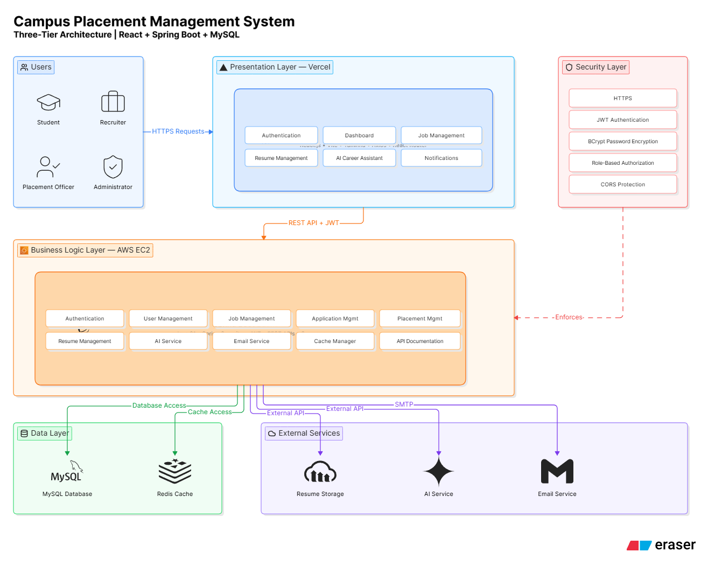
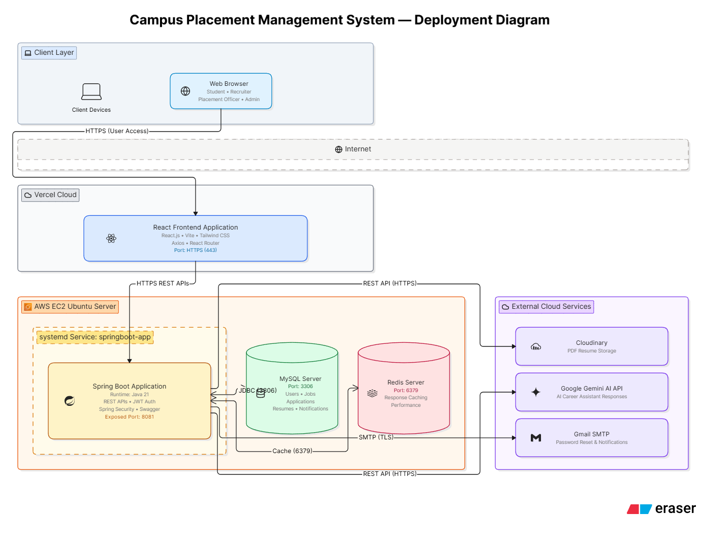
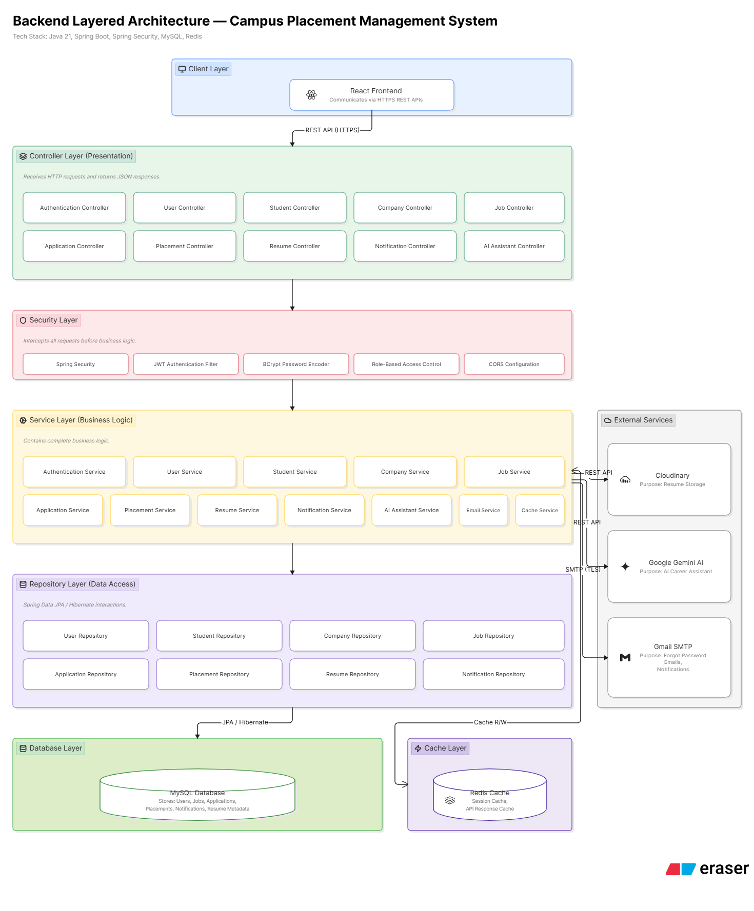
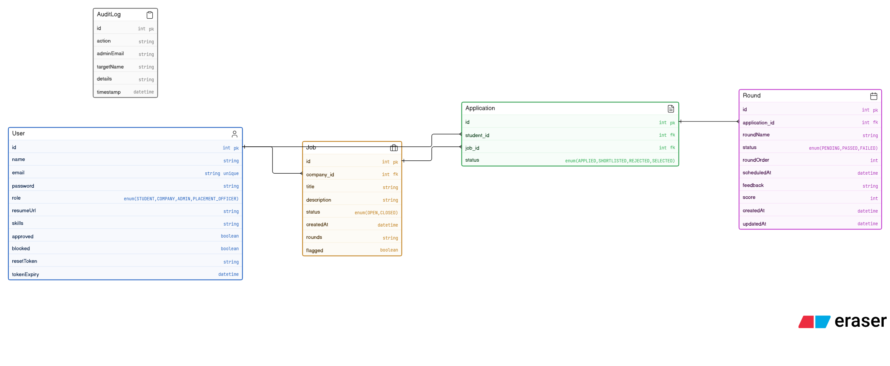
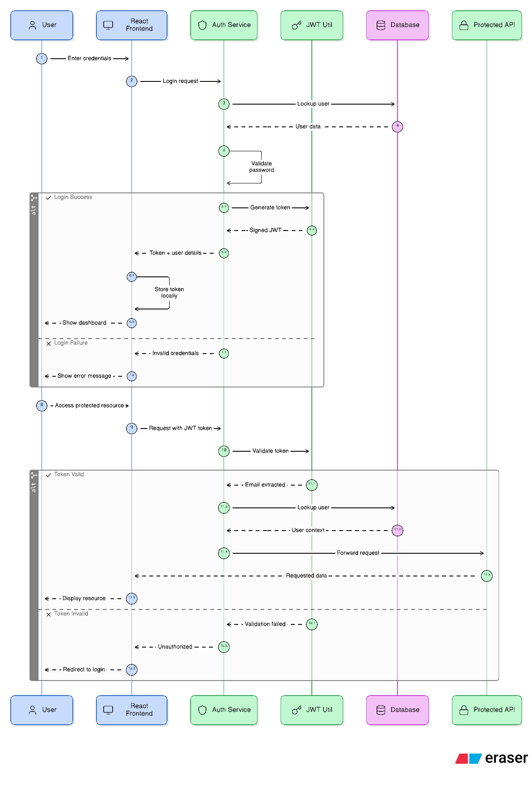
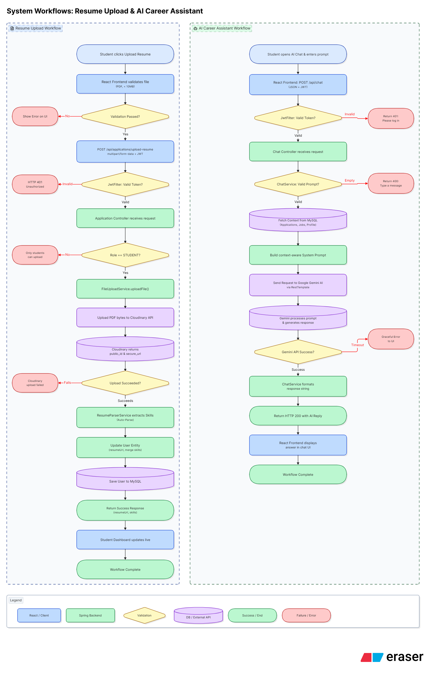
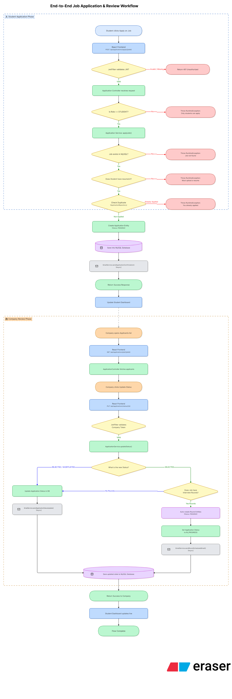

<h1 align="center">🎓 Campus Placement Management System</h1>

  
  
  
  
  
  
  
  
  

A professional, full-stack **Campus Placement Management System** designed to streamline the recruitment process for Students, Companies, Placement Officers, and Administrators.

---

## 📑 Table of Contents

- [Features](#-features)
- [Tech Stack](#-tech-stack)
- [System Architecture](#-system-architecture)
- [Deployment Architecture](#-deployment-architecture)
- [Backend Layered Architecture](#-backend-layered-architecture)
- [ER Diagram](#-er-diagram)
- [Workflows](#-workflows)
  - [JWT Authentication Flow](#jwt-authentication-flow)
  - [Job Application Workflow](#job-application-workflow)
  - [Resume Upload & AI Assistant Workflow](#resume-upload--ai-assistant-workflow)
- [API Modules](#-api-modules)
- [Security Features](#-security-features)
- [Live Demo](#-live-demo)
- [Installation](#-installation)
- [Deployment Guide](#-deployment-guide)
- [Future Enhancements](#-future-enhancements)
- [License](#-license)

---

## ✨ Features

- **Role-Based Access Control (RBAC):** Distinct portals for Students, Companies, Placement Officers, and Admins.
- **JWT Authentication:** Stateless, secure API requests.
- **Resume Parsing & Storage:** Upload PDF resumes directly to **Cloudinary**, with automated skill extraction.
- **AI Career Assistant:** Integrated with **Google Gemini AI** to provide context-aware chatbot guidance.
- **Job Management:** Companies can post jobs, manage rounds, and update application statuses (Applied, Shortlisted, Selected).
- **Application Tracking:** Students can track their application status and view interview schedules.
- **Email Notifications:** Automatic **Gmail SMTP** notifications for job applications, round scheduling, and password resets.
- **Performance Optimization:** Implemented **Redis** caching for faster dashboard metrics and data retrieval.
- **API Documentation:** Fully documented with **Swagger UI / OpenAPI**.

---

## 🛠 Tech Stack

### Frontend
- **React.js** (Vite)
- **Tailwind CSS**
- **React Router DOM**
- **Axios**

### Backend
- **Java 21**
- **Spring Boot 3**
- **Spring Security (JWT)**
- **Spring Data JPA (Hibernate)**

### Database & Caching
- **MySQL 8**
- **Redis**

### External Cloud Services
- **AWS EC2** (Backend & DB Hosting)
- **Vercel** (Frontend Hosting)
- **Cloudinary** (Secure File Storage)
- **Google Gemini AI API** (Generative AI Chat)
- **Gmail SMTP** (Email Delivery)

---

## 🏛 System Architecture

Our system utilizes a classic **Three-Tier Architecture** tailored for the cloud:
1. **Presentation Layer:** Hosted on Vercel, providing a responsive React interface.
2. **Business Logic Layer:** Hosted on AWS EC2, containing the Spring Boot services, security logic, and API controllers.
3. **Data Layer:** MySQL and Redis hosted alongside the backend on EC2 for ultra-low latency data access. External APIs handle specialized tasks.

---

## ☁️ Deployment Architecture

- **Vercel:** Serves the built frontend static assets via CDN. Proxies API requests to bypass Mixed Content restrictions.
- **AWS EC2 (Ubuntu):** Runs the Spring Boot backend as a systemd service on port 8081. Hosts MySQL (3306) and Redis (6379) internally.
- **Cloud Services:** The EC2 backend communicates securely with Cloudinary, Gemini, and Google SMTP over the public internet (HTTPS/TLS).

---

## 🏗 Backend Layered Architecture

- **Controllers:** Expose RESTful endpoints.
- **Security:** Intercepts requests, validates JWTs, and enforces Role-Based access.
- **Services:** Contains the core business logic and communicates with external APIs (Cloudinary, Gemini) and Cache (Redis).
- **Repositories:** Manages database interactions via Spring Data JPA.

---

## 🗄 ER Diagram

**Key Relationships:**
- **User (COMPANY) → Job:** One-to-Many
- **User (STUDENT) → Application:** One-to-Many
- **Job → Application:** One-to-Many
- **Application → Round:** One-to-Many

---

## 🔄 Workflows

### JWT Authentication Flow

*Illustrates the process of credential validation, BCrypt password checking, token generation, and subsequent request interception by the JwtFilter.*

### Job Application Workflow

*Traces the complete lifecycle from a student clicking 'Apply', checking duplicate rules, auto-generating interview rounds upon selection, and dispatching async email notifications.*

### Resume Upload & AI Assistant Workflow

*Demonstrates the multipart upload sequence to Cloudinary (bypassing local storage) and the context-aware prompt generation for Google Gemini AI.*

---

## 🌐 API Modules

Fully documented via **Swagger / OpenAPI**:
- **Auth (/api/auth):** Registration, Login, Forgot Password.
- **Users (/api/users):** Profile management, role fetching.
- **Jobs (/api/jobs):** CRUD operations for job postings, search, and filtering.
- **Applications (/api/applications):** Job applications, status updates, resume uploads, and parsing.
- **Rounds (/api/rounds):** Interview scheduling, feedback, and scoring.
- **Analytics (/api/dashboard):** Real-time statistics using Redis cache.
- **AI Assistant (/api/chat):** Context-aware career chatbot queries.
- **Admin (/api/admin):** User approvals, blocking, and audit logs.
- **Notifications (/api/notifications):** WebSocket messaging endpoints.

---

## 🔒 Security Features

- **Stateless Authentication:** JSON Web Tokens (JWT).
- **Password Protection:** BCrypt hashing algorithm.
- **RBAC:** @PreAuthorize and manual role checks ensuring companies cannot access student resources and vice versa.
- **CORS Configuration:** Explicitly configured origin whitelists.
- **Input Validation:** Hibernate Validator (@Valid, @NotBlank, etc.) preventing malformed requests.

---

## 🚀 Live Demo

- **Frontend (Vercel):** [https://campus-placement-frontend-nu.vercel.app](https://campus-placement-frontend-nu.vercel.app)
- **Backend API:** http://3.208.20.63:8081
- **Swagger Documentation:** [http://3.208.20.63:8081/swagger-ui/index.html](http://3.208.20.63:8081/swagger-ui/index.html)

---

## ⚙️ Installation & Setup

### Prerequisites
- Node.js (v18+)
- Java 21
- Maven
- MySQL 8
- Redis Server

### 1. Backend Setup
`ash
git clone https://github.com/yourusername/CampusPlacementManagement.git
cd CampusPlacementManagement

# Set Environment Variables (see below)
# Build and Run
mvn clean install
mvn spring-boot:run
`

### 2. Frontend Setup
`ash
cd frontend
npm install
npm run dev
`

---

## 🔑 Environment Variables

Create a .env file for the Backend, or set these in your OS:

| Variable | Description |
|---|---|
| DB_USERNAME | MySQL database username |
| DB_PASSWORD | MySQL database password |
| JWT_SECRET | Secret key for signing JWTs (must be long) |
| CLOUDINARY_CLOUD_NAME | Your Cloudinary Cloud Name |
| CLOUDINARY_API_KEY | Your Cloudinary API Key |
| CLOUDINARY_API_SECRET | Your Cloudinary API Secret |
| GEMINI_API_KEY | Google Gemini API Key |
| MAIL_USERNAME | Gmail address for SMTP |
| MAIL_PASSWORD | Gmail App Password |
| FRONTEND_URL | e.g., http://localhost:5173 or Vercel URL |

---

## 🚢 Deployment Guide

- **Frontend:** Pushed directly to Vercel via GitHub integration. A ercel.json file is included to handle React SPA routing and proxying /api/* to the EC2 backend to resolve Mixed Content issues.
- **Backend:** 
  1. Built via mvn clean package.
  2. JAR transferred to AWS EC2 instance.
  3. Configured to run infinitely in the background using a systemd service (/etc/systemd/system/springboot-app.service).

---

## 🔮 Future Enhancements

- Integrate WebRTC for in-platform video interviews.
- Implement an automated Coding Assessment environment.
- Add OAuth2 login (Google/GitHub/LinkedIn).
- Secure the EC2 backend with an NGINX reverse proxy and Let's Encrypt SSL.

---

## 👤 Author

**Shrenik Kondekar**

---

## 📄 License

This project is licensed under the [MIT License](LICENSE).
